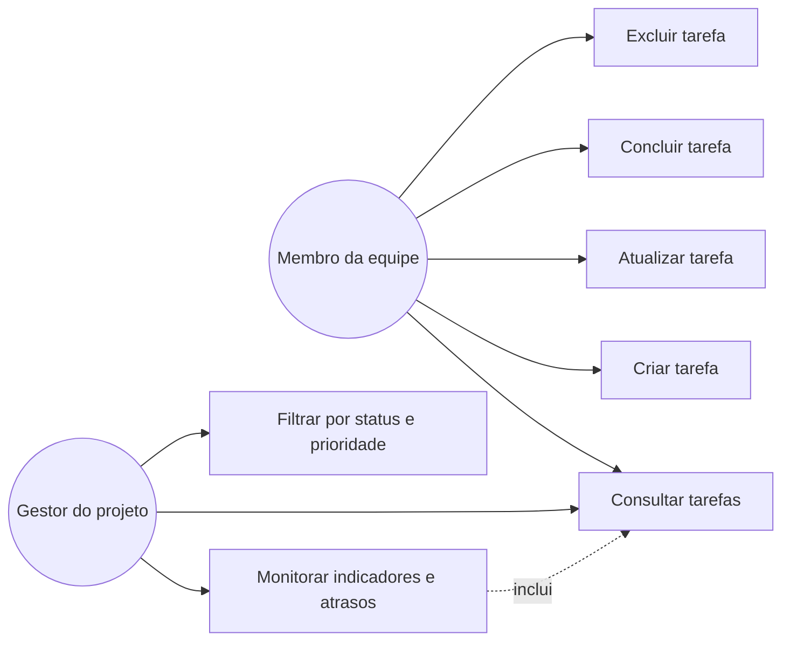
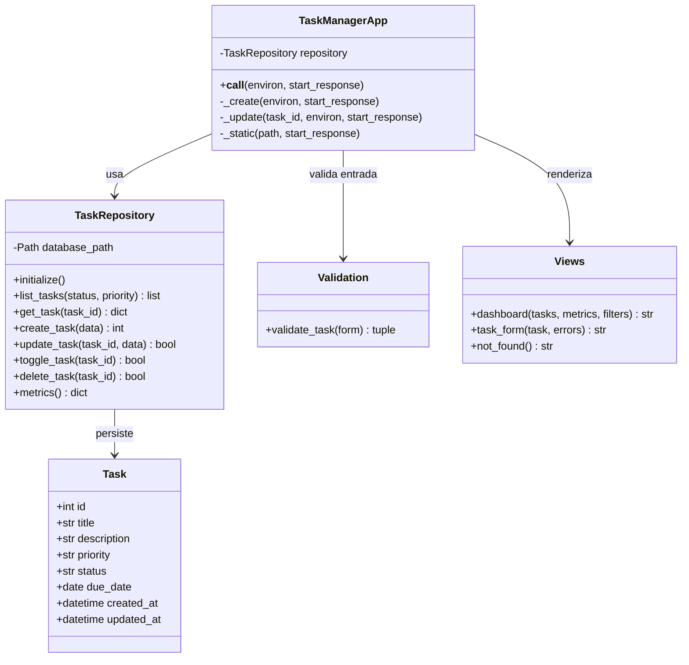

# Modelagem UML

Os diagramas abaixo registram a visão funcional e estrutural do TechFlow Task Manager.

## Diagrama de casos de uso

## Diagrama de classes

## Por que modelar

A modelagem reduz ambiguidades antes da codificação. O diagrama de casos de uso aproxima o
sistema das necessidades dos usuários, enquanto o diagrama de classes explicita
responsabilidades, dependências e dados persistidos. Essa visão facilita estimativas, revisão,
testes e futuras mudanças sem exigir a leitura imediata de todo o código.

